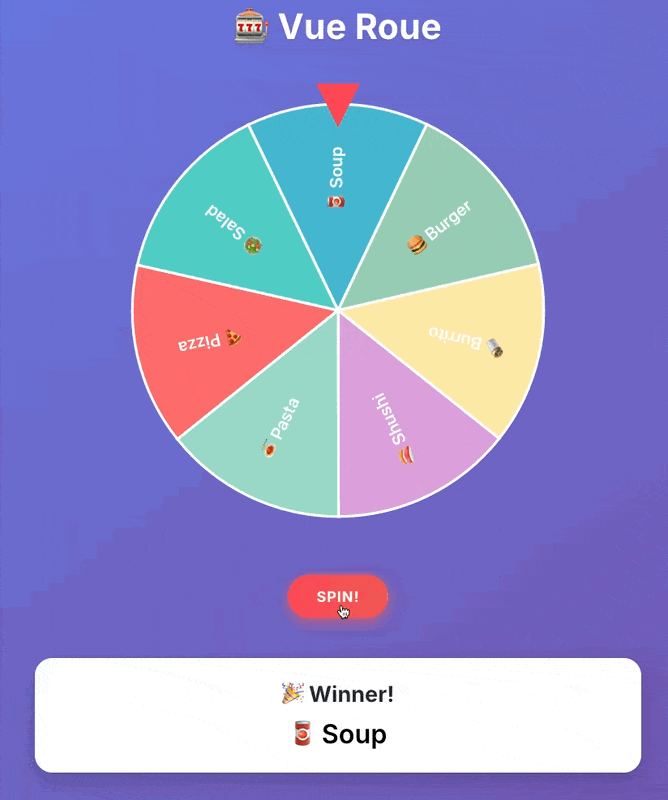

# 🎡 Roue

[](https://www.npmjs.com/package/wheel-of-fortune)
[](./LICENSE)
[](https://vuejs.org/)

A reusable and customizable **Vue 3** component to spin a wheel of fortune — perfect for games, giveaways, raffles, or any luck-based mechanic.

> ✨ Built with ❤️, [Vue 3](https://vuejs.org/), [TypeScript](https://www.typescriptlang.org/) & [Tailwind CSS](https://tailwindcss.com/)

---

## Demo



## 🚀 Features

- 🎯 Fully interactive — Spin the wheel with a button or programmatically
- 🎛 Optional user controls — Let users edit segment values and colors directly in the UI
- 🏆 Optional winner display — Automatically shows the selected segment after spinning
- 🖱 Optional spin button — Display a built-in "SPIN!" button or trigger manually
- 🎨 Custom or preset segments — Provide your own segments or use built-in presets like:
  - Fibonacci
  - T-shirt sizes (S, M, L, XL…)
  - Yes/No/Maybe
  - ...

---

## 📦 Installation

```bash
pnpm add vue-roue
# or
npm install vue-roue
```
---

## 🛠 Usage

```html
<!-- App.vue -->
<script setup lang="ts">
import { ref } from "vue"
import "vue-roue/style.css"
import VueRoue from "vue-roue"

const segments = [
  { name: "🐱 Cat", color: "#f87171" },
  { name: "🐶 Dog", color: "#60a5fa" },
  { name: "🐔 Chicken", color: "#34d399" }
]

// Or use included preset
import { lunch } from "vue-roue"
const segments = lunch

const wheelRef = ref()

// To spin the wheel programmatically
const spin = () => wheelRef.value?.spin()

const handleWinner = (value: string) => {
  console.log("Winner is:", value)
}
</script>

<template>
  <Roue
    ref="wheelRef"
    :segments="segments"
    :wheel-size="450"
    with-spin-button
    with-winner-display
    with-controls
    @winner="handleWinner"
  />
</template>
```

### ⚙️ Props

| Prop                | Type        | Default | Description                              |
| ------------------- | ----------- | ------- | ---------------------------------------- |
| `segments`          | `Segment[]` | —       | Required. List of segments to spin.      |
| `wheelSize`         | `number`    | `600`   | Size of the wheel in pixels.             |
| `withSpinButton`    | `boolean`   | `false` | Show a "SPIN" button under the wheel.    |
| `withWinnerDisplay` | `boolean`   | `false` | Show the winner name below the wheel.    |
| `withControls`      | `boolean`   | `false` | Show segment editing UI below the wheel. |

---

### 🔁 Exposed Methods

> Call `spin()` programmatically using `ref`:

```ts
const wheelRef = ref()
wheelRef.value?.spin()
```

---

### 📤 Events

| Event    | Payload  | Description                  |
| -------- | -------- | ---------------------------- |
| `winner` | `string` | Emitted when a segment wins. |

---

### 🧩 Types
```ts
type HexColor = `#${string}`

type Segment = {
  name: string
  color?: HexColor
}
```

---

### 🎨 Presets

| Name            | Description                  | Values                                                                                |
| --------------- | ---------------------------- | ------------------------------------------------------------------------------------- |
| `fibonacci`     | Estimation using Fibonacci   | `0`, `1`, `2`, `3`, `5`, `8`, `13`, `20`, `☕`, `❓`                                    |
| `tshirts`       | T-shirt sizing scale         | `XS`, `S`, `M`, `L`, `XL`                                                             |
| `yesNoMaybe`    | Simple decision options      | `Yes`, `No`, `Maybe`                                                                  |
| `dice`          | Simulates a 6-sided dice     | `1`, `2`, `3`, `4`, `5`, `6`                                                          |
| `nightActivity` | Evening activity suggestions | `📺 TV show`, `🎥 Movie`, `🎮 Video game`, `♟️ Board game`, `📖 Book`, `💤 Sleep`     |
| `lunch`         | Lunch ideas                  | `🍕 Pizza`, `🥗 Salad`, `🥫 Soup`, `🍔 Burger`, `🌯 Burrito`, `🍣 Shushi`, `🍝 Pasta` |


---

## 👥 Contribution

Clone the repo and run locally:
```bash
pnpm install
pnpm dev
```

Build the package:
```bash
pnpm build
````

> Feel free to open a PR if something's missing 🙏
